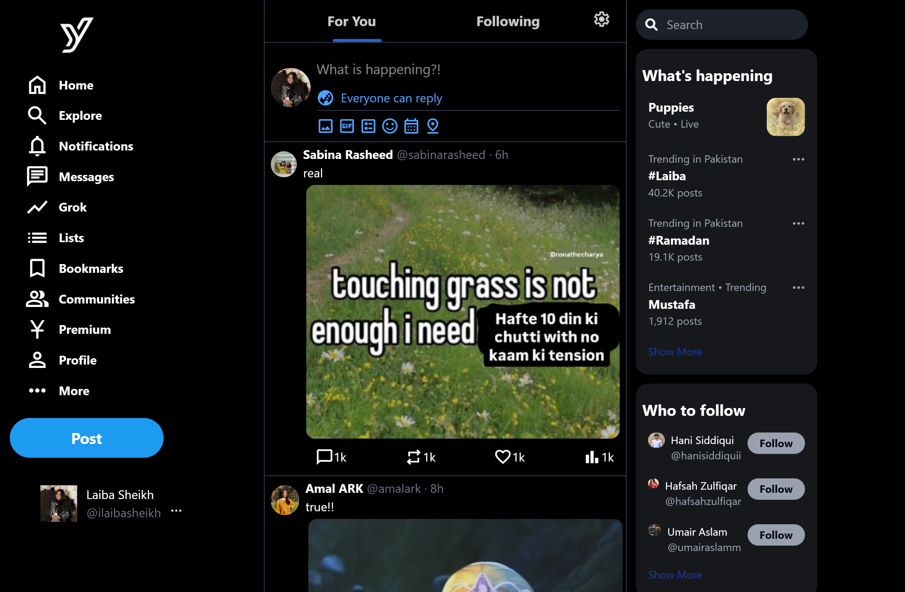
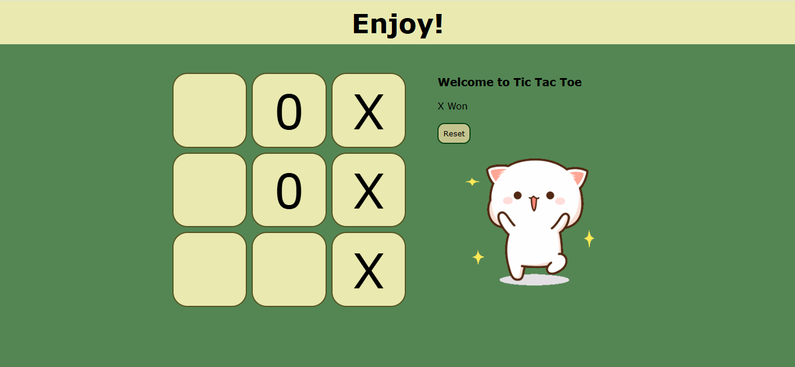

# WebDev Projects

This repository showcases a series of web development projects built using **HTML**, **CSS**, **JavaScript**, **Tailwind**  for design mockups.

## Projects

### 1. **ChickFlix** 

A movie streaming clone inspired by services like Netflix, using HTML and CSS.

**Features:**
- Landing page of streaming site
- Responsive design 
- Clean UI inspired by modern streaming services
- [Check Repository](https://github.com/ilaibasheikh/ChickFlix)

### 2. **Jamify**

A music streaming clone inspired by services like Spotify, where users can listen to their favorite music, using HTML, CSS and Javascript.

**Features:**
- Audio player functionality
- User-friendly interface 
- Responsive design
- [Check Repository](https://github.com/ilaibasheikh/Jamify)

### 3. **Y.com**

A modern microblogging clone inspired by services like X.com (formerly Twitter). Built with HTML and TailwindCSS.

**Features:**
- Landing page
- Clean and simple UI
- Fully responsive design using TailwindCSS
- [Check Repository](https://github.com/ilaibasheikh/Y.com)


### 4. **Tic Tac Toe**

A simple web-based version of the classic Tic Tac Toe game, using HTML, CSS and Javascript.

**Features:**
- Interactive gameplay
- Two-player mode
- Basic JavaScript functionality for game logic
- [Check Repository](https://github.com/ilaibasheikh/TicTacToe)

### 5. **Transparent Login Form**


A simple transparent login form created using HTML and CSS. 

**Features:**
- Works seamlessly with any background picture
- Customizable
- Cohesive Design
- [Check Repository](https://github.com/ilaibasheikh/TransparentLoginForm)

### 6. **Black Jack Game**


A simple web-based Blackjack game built using **HTML**, **CSS**, and **JavaScript**.

**Features:**
- Start a new game with two random cards
- Draw new cards to reach 21 without exceeding it
- Win or lose based on your card sum
- Player's name and chips displayed at the top
- Customizable game logic and simple UI
- [Check Repository](https://github.com/ilaibasheikh/WebDev/tree/main/javascript/Black%20Jack%20Game)

### 7. **Leads Tracker Chrome Extension**


A handy Chrome Extension to quickly save useful links or tabs for later. Perfect for students, researchers, and developers who want to keep track of important resources without bookmarking every page.

**Features:**
- Save links manually or from the current tab  
- Display saved links as clickable items  
- Persist data using `localStorage`  
- Delete all leads with a double-click  
- [Check Repository](https://github.com/ilaibasheikh/WebDev/tree/main/Chrome_Extension)

---

## Technologies Used

- **HTML**: For structuring the web pages.
- **CSS**: For styling the pages. Used both plain CSS and frameworks like **Bootstrap** and **Tailwind** for faster, responsive design.
- **JavaScript**: For interactive elements and game logic.

---

## Installation

1. Clone this repository:
   ```bash
   git clone https://github.com/ilaibasheikh/WebDev.git
